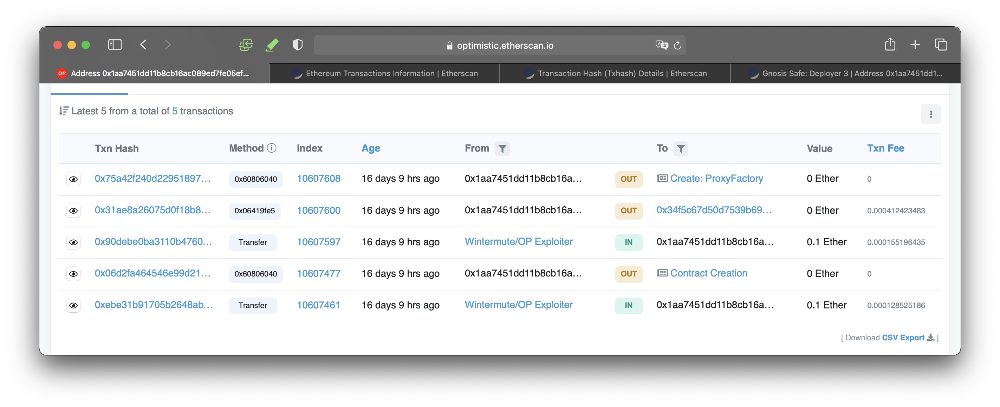

# Wintermute & OP

## Abstract

| Status       | Fixed                                                                          |   |
| ------------ | ------------------------------------------------------------------------------ | - |
| Type         | Contract, Cross-chain replay attack                                            |   |
| Date         | Jun 05, 2022                                                                   |   |
| Source       | [@kelvinfichter](https://twitter.com/kelvinfichter/status/1534636743223386119) |   |
| Direct Loss  | 20M $OP tokens (\~ $30M)                                                       |   |
| Project Repo | -                                                                              |   |

## Background

Wintermute is a famous crypto market maker. They were about to cooperate with Optimism to provide liquidity for $OP tokens.

Wintermute puts its assets in Gnosis Safe multi-sig smart contract wallets on different chains.

They asked Optimism to transfer [$OP](https://twitter.com/search?q=%24OP\&src=cashtag\_click) directly to their wallet address on Optimism chain. But that address was only deployed with Gnosis Safe on Ethereum, not on OP, so it was just an EOA there.

## Attack Vectors in a Row

### Holistic View

1. Find the factory creation tx on Ethereum to replay on Optimism ->
2. Create a factory contract on OP with the same address as the old one on Ethereum ->
3. Make a wallet from the factory contract with the same address as the old one on Ethereum. Set definite ownership parameters and the attacker wins.

### The old transaction for factory creation

Why an old transaction was needed here? Because when you deploy a contract, its address is **deterministically** **dependent** on the `sender’s address` and `nonce`:

> deployed address = keccak256(sender's address, sender's nonce)

If one of them failed to match, the desired address won’t show up.

The factory was deployed by [0x1aa7451dd11b8cb16ac089ed7fe05efa00100a6a](https://etherscan.io/address/0x1aa7451dd11b8cb16ac089ed7fe05efa00100a6a)(Gnosis Deployer 3) on Ethereum.

**Factory creation transaction**

[https://etherscan.io/tx/0x75a42f240d229518979199f56cd7c82e4fc1f1a20ad9a4864c635354b4a34261](https://etherscan.io/tx/0x75a42f240d229518979199f56cd7c82e4fc1f1a20ad9a4864c635354b4a34261)

**Factory address**

[0x76e2cfc1f5fa8f6a5b3fc4c8f4788f0116861f9b](https://etherscan.io/address/0x76e2cfc1f5fa8f6a5b3fc4c8f4788f0116861f9b)

### Replay attack

They were relative ancient transactions, which didn't implement EIP155 which contains chainId in signatures to prevent cross-chain replay attacks.

The [hacker](https://optimistic.etherscan.io/address/0x60b28637879b5a09d21b68040020ffbf7dba5107) noticed this particular situation. He took the raw transaction data of GD3 from Ethereum and replayed them on Optimism. There are three critical transactions which are useful for the attack so he just cloned these, before that he also sent some ETH to GD3 as gas.

**Transactions from Gnosis Deployer 3 on Optimism**

[https://optimistic.etherscan.io/address/0x1aa7451dd11b8cb16ac089ed7fe05efa00100a6a](https://optimistic.etherscan.io/address/0x1aa7451dd11b8cb16ac089ed7fe05efa00100a6a)

The transactions above, seem to come from GD3 but they were actually replayed by the hacker. GD3 himself didn't even aware he was impersonated.

### Nonce++

Since he had created the factory, the next step is to make the wallet contract with the targeted address.

**Target Address(Wintermute's wallet):**

\*\*\*\*[_0x4f3a120e72c76c22ae802d129f599bfdbc31cb8_](https://etherscan.io/address/0x4f3a120e72c76c22ae802d129f599bfdbc31cb81)

Unfortunately, the reason this step is viable is also caused by the vulnerability of deterministic address creation: the factory utilised `CREATE` not `CREATE2` function to create its derivations.

\
`CREATE` : `keccak256(rlp.encode(deployingAddress, nonce))[12:]`

`CREATE2` : `keccak256(0xff ++ deployingAddr ++ salt ++ keccak256(bytecode))[12:]`

In `CREATE2` it takes additional parameters thus has the ability to prevent different `msg.sender` generating same contract address.

So, the hacker was able to generate new by calling the wallet creation function in the factory multiple times until the `nonce` met the targeted one.

He utilised a helper contract which contained a `for` loop to call wallet creation 162 times per transaction. And after 60+ transactions, he got the target and turned it from an EOA into a smart contract wallet controlled by him.

## Aftermath

Report from [Oluwapelumi Adejumo](https://cryptoslate.com/optimism-hacker-confirms-they-are-whitehat-returns-most-of-stolen-funds/)

> The hacker will be keeping the remaining 2 million OP tokens as a bounty. Optimism foundation also confirmed that it is in the process of recovering the 1 million OP sent to Vitalik Buterin.
>
> The news of the return has had a positive influence on OP price. The token has risen by 13.2% in the last 24 hours, making it one of the biggest gainers today.

## Summary

* To prevent possible replay attacks of different forms(cross-chain, contract deploy, etc.), it's recommended to use EIP155 standard transaction and `CREATE2`.
* EOAs are naturally cross-chain accounts while smart contract wallets are not. Users should beware of the difference and maybe developers could abstract a more robust and friendly user-level interface.
* There were eight days before the hack since Wintermute found this issue. For such a big amount they reacted slowly. If they reported the issue to Optimism in the first place, maybe they could find a way out in time.
