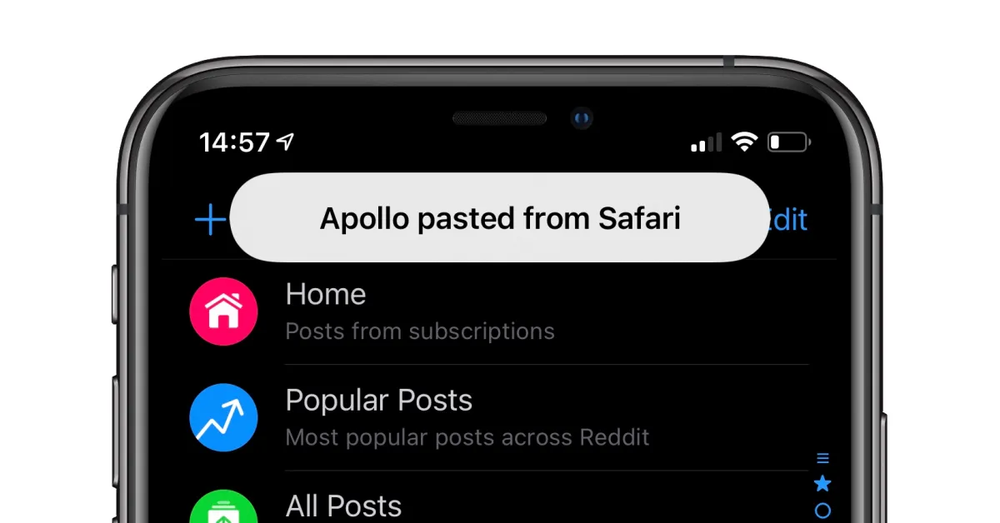

# Clipboard Safety

## Abstract

One of the general approaches for ordinary users to use one account in different wallet clients is to copy & paste mnemonic words or private keys. For cross-device copy, an intermediary messenger may be used, e.g. Telegram, WeChat, etc.

There are significant security risks within such a process. None of the mainstream OSes can maintain absolute clipboard safety. iOS does this better than others but still not enough.

## Windows

Windows software has almost unlimited power to access and manipulate the clipboard. It can read and set content easily without warning or reminder to the user.

```
//.NET
// Namespace: System.Windows.Forms
Clipboard.GetText()
Clipboard.SetText(string)

// UWP
// Namespace: Windows.ApplicationModel.DataTransfer
Clipboard.SetContent(dataPackage)
Clipboard.GetContent()
```

## macOS

Like Windows, any desktop platform can easily access or change the clipboard without warning.

```
// Cocoa
// Class NSPasteboard
func string(forType dataType: NSPasteboard.PasteboardType) -> String?
func setString(_ string: String, forType dataType: NSPasteboard.PasteboardType) -> Bool
```

## iOS

iOS is better and more secure on this topic. But it's still too difficult for ordinary users to identify and prevent malicious clipboard monitoring in advance.

Apps in the foreground or background-mode-enabled apps(map, music player, etc.) could read your pasteboard.&#x20;

A suspended app(turned into background and has no background working manifest) cannot.

Starting in iOS 14, the system **notifies** the user when an app gets **general pasteboard** content that originated in a different app.&#x20;



```
// Cocoa Touch
// Class UIPasteboard
func data(forPasteboardType pasteboardType: String, inItemSet itemSet: IndexSet?) -> [Data]?
func setData(_ data: Data, forPasteboardType pasteboardType: String)
```

Some apps could use `UIPasteboard.DetectionPattern` to make a primitive filter to reduce the frequency of the notification. Accessing this structure, the app will only know if the content inside the pasteboard matches some criteria but not the content itself. Thus no notification shows up. This filter is limited and simple but not something like RegExp that can match exactly seed phrases or private keys.

### Handoff

With Handoff, when a user’s iOS, iPadOS, and macOS devices are near each other, their clipboards are shared.&#x20;

According to Apple's technical docs, we can assume handoff is secure in the transmission stage. But it can't prevent clipboard monitor apps/malware on both devices.

> When a user signs in to iCloud on a second Handoff-capable device, the two devices establish a Bluetooth Low Energy (BLE) 4.2 pairing out-of-band using APNs. The individual messages are encrypted much like messages in iMessage are. After the devices are paired, each device generates a symmetric 256-bit AES key that gets stored in the device’s [keychain](https://support.apple.com/zh-cn/guide/security/aside/sec1e14cf8d3/1/web/1). This key can encrypt and authenticate the BLE advertisements that communicate the device’s current activity to other iCloud paired devices using AES256 in GCM mode, with replay protection measures.
>
> The first time a device receives an advertisement from a new key, it establishes a BLE connection to the originating device and performs an advertisement encryption key exchange. This connection is secured using standard BLE 4.2 encryption as well as encryption of the individual messages, which is similar to how iMessage is encrypted. In some situations, these messages are sent using APNs instead of BLE. The activity payload is protected and transferred in the same way as an iMessage.

## Android

Though in Android, there are clear application lifecycles as in iOS, an app could bypass that with at least 10 ways to bypass lifecycle limitations to keep itself in a running state that can monitor other things. And there is no clipboard notification on Android.

We can say, the situation here is **as bad as desktop** platforms.

```
// Android, Java
pasteData = clipboard.getPrimaryClip().getItemAt(0).item.getText();
clipboard.setPrimaryClip(ClipData.newPlainText("simple text", "Hello, World!"););
```

## Advice

* For app **developers**, if your app allows users to paste their mnemonic words/private keys, it's recommended to **clear the clipboard after the user pasted**.
* For **users**, if you copied your sensitive data and pasted it somewhere, it's recommended to open another system app(e.g. Notepad, assuming it's safe) and **copy some random content to clear your clipboard**.


